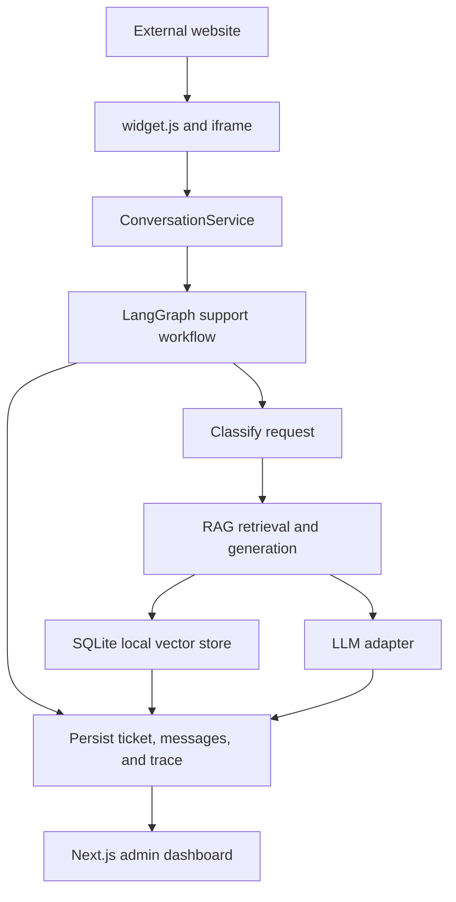
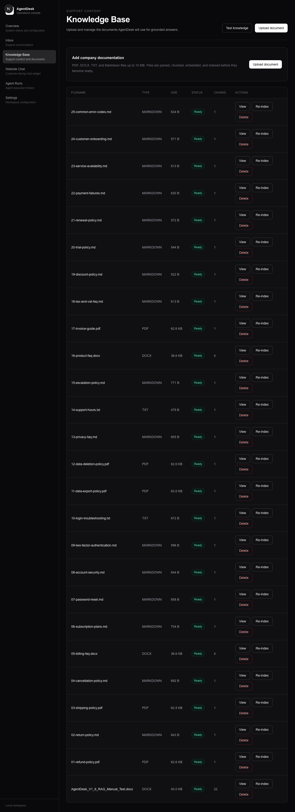
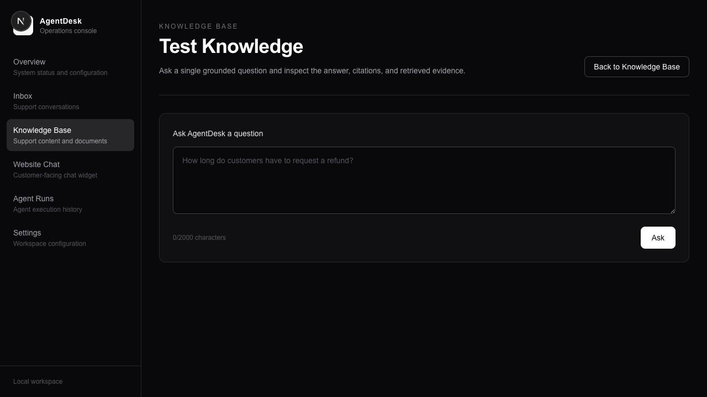
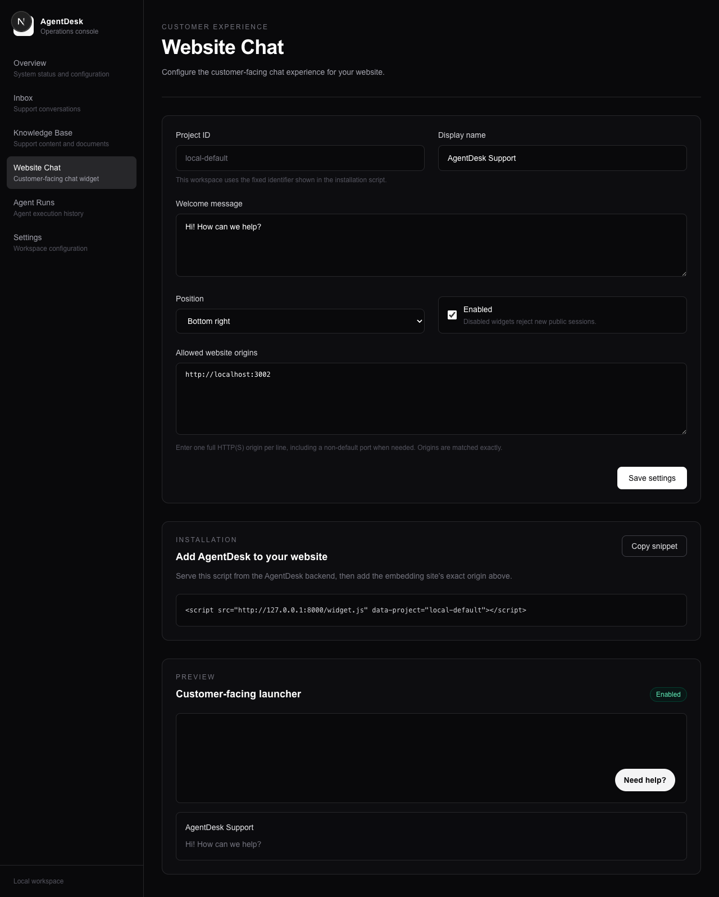
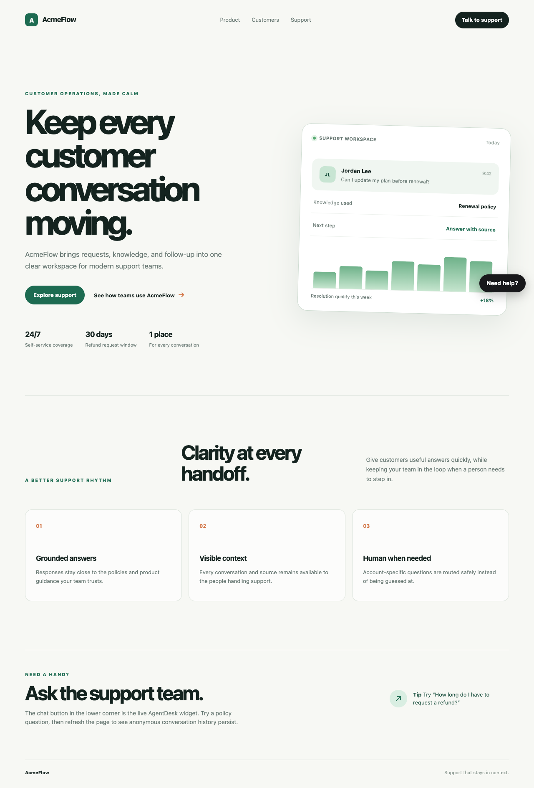
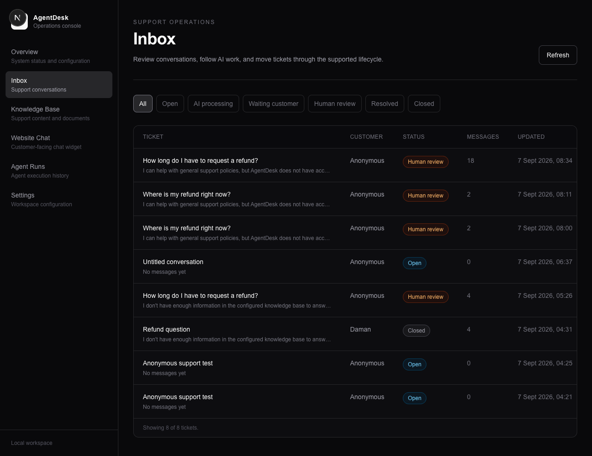
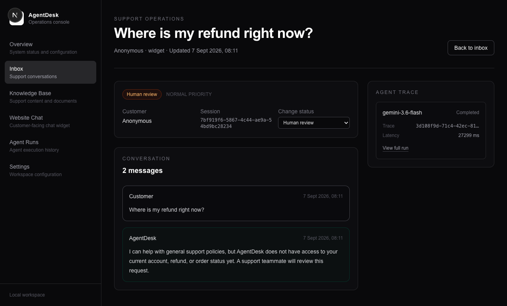
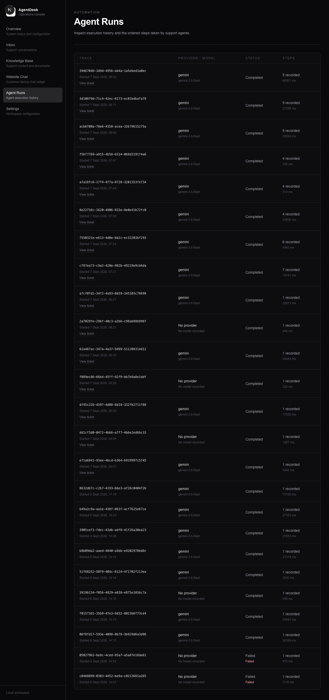
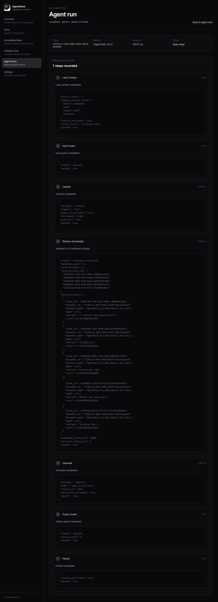

# AgentDesk

AgentDesk is a local-first customer support workspace. It combines a small
admin dashboard, a grounded knowledge base, configurable LLM-backed answers,
an embedded website chat widget, persistent tickets, and inspectable LangGraph
execution traces.

V1 is a safe support assistant rather than an autonomous business operator. It
answers from indexed documents when evidence is available and routes
account-specific or uncertain requests for human review.

## Features

- First-run setup for company, Gemini or OpenRouter, and local storage
  configuration.
- Gemini and OpenRouter LLM adapters behind a shared abstraction, plus local
  Sentence Transformer embeddings.
- PDF, DOCX, TXT, and Markdown knowledge ingestion with deterministic chunks.
- Retrieval-augmented answers with source citations and insufficient-evidence
  handling.
- Persistent tickets, conversations, customer messages, and AI replies.
- One-script website widget backed by an isolated iframe and anonymous sessions.
- LangGraph support workflow with ordered AgentRun and AgentStep traces.
- Local dashboard pages for overview, knowledge, RAG testing, inbox, widget
  settings, and run inspection.

## Architecture



The backend is FastAPI with SQLAlchemy and Alembic over local SQLite. The
frontend is Next.js. Knowledge embeddings use the local `all-MiniLM-L6-v2`
Sentence Transformer by default. Gemini and OpenRouter calls are confined to
their provider adapters; the local embedding path does not require either LLM
provider or its API key.

## Requirements

The exact environment verified for this release is:

- macOS on this development machine.
- Python 3.14.2 with a virtual environment.
- Node.js 22.20.0 and npm 10.9.3.
- A current browser with JavaScript enabled.
- Network access for the selected LLM provider and, on the first
  local-ingestion run, for downloading the Sentence Transformer model if it is
  not already cached.

The launcher requires Python 3.11 or newer, but Python 3.11, 3.12, 3.13,
Windows, and Linux have not been independently verified in this repository.
Use the exact versions above when reproducing the checked-in verification.

LLM generation requires a key with access to the configured model. Gemini and
OpenRouter keys are entered in the setup wizard or dashboard settings and
encrypted by the backend; they are never returned by the settings API or
exposed to the browser widget.

## Quick Start

From a fresh clone:

```bash
git clone <repository-url>
cd AgentDesk

python3.14 -m venv .venv
source .venv/bin/activate
python -m pip install -r backend/requirements.txt

cd frontend
npm install
cd ..

python run.py
```

`run.py` applies `alembic upgrade head`, checks the required tools and ports,
starts the backend on `http://127.0.0.1:8000`, starts Next.js on
`http://127.0.0.1:3000`, waits for both health checks, and opens the browser.
It does not silently move the frontend to port 3001. If port 8000 or 3000 is
already occupied, stop the existing process and run it again.

If `npm install` or the backend dependency install has not completed, the
launcher reports the missing prerequisite and the command to run. Press
`Ctrl+C` to stop both development process groups.

## First Run

The browser opens the setup wizard when the local configuration is incomplete:

1. Enter the company name and support details.
2. Choose Google Gemini or OpenRouter, select or enter a model, paste the
   provider API key, and use **Test connection**.
3. Confirm local storage and finish setup.
4. The root route then opens the dashboard on later restarts.


The saved AI settings expose only the provider, model, and configured status.
The encrypted key is stored under the local data directory. A checked-in `.env`
file is not required for the setup flow; do not commit secrets.

## Configure an LLM provider

Open **Dashboard > Settings** to update the company or AI provider. Gemini
offers the supported Gemini model list. OpenRouter accepts a validated
`author/model` slug and includes catalog suggestions such as
`google/gemma-4-26b-a4b-it` and `openrouter/free`.

The test connection uses the selected adapter and a real generation request.
For OpenRouter it also sends the structured JSON-schema probe required by the
AgentDesk classifier, so a model that cannot satisfy structured output fails
configuration validation before it reaches production traffic. Invalid
credentials, unavailable models, malformed requests, quota errors, and
timeouts are reported as their corresponding safe provider errors.

## Upload Knowledge

The normal fictional AcmeFlow corpus contains 25 documents in
`samples/demo-company/`, covering refund, password, billing, security,
availability, and related support topics. All four supported formats are
represented: PDF, DOCX, TXT, and Markdown.

Load it through the real ingestion API with:

```bash
python scripts/load_demo_knowledge.py
```

Run that command from the repository root while the backend is running. It
lists existing filenames and skips them on a repeat run. Use `--replace` when
you intentionally want to delete matching documents through the API and
re-index them. Use `--dry-run` to inspect the files without changing AgentDesk.

Each document moves through `uploaded`, `processing`, and `ready` during
ingestion. The first local embedding call may download and load the model; it
does not use Gemini, OpenRouter, or an LLM API key. Failed PDF/DOCX parsing and
embedding errors are recorded as a safe `failed` document state. Malformed
fixtures live separately under `samples/test-fixtures/` and are not loaded by
the script.



## Test RAG

Open **Dashboard > Knowledge > RAG test** and ask questions such as:

- `How long do I have to request a refund?` should cite
  `01-refund-policy.pdf` and state 30 calendar days.
- `How do I reset my password?` should cite the password-reset document.
- `What does AF-429 mean?` should cite the common error code document.
- `Does AcmeFlow provide free laptops?` should report insufficient evidence.
- `Where is my refund right now?` is account-specific. The classifier routes it
  to the safe account-data path, does not retrieve or invent a refund status,
  and creates or updates a human-review ticket.

The RAG console displays citations, retrieved chunks, latency, and the
insufficient-evidence flag.



## Configure Website Chat

Open **Dashboard > Website Chat**. Configure the display name, welcome message,
launcher position, enabled flag, and one or more exact HTTP(S) website origins.
An origin includes its scheme and port, for example
`http://localhost:3002`. Wildcards and bare hostnames are rejected.



## Embed the Widget

Add one script tag to an external page after saving the matching allowed origin:

```html
<script
  src="http://127.0.0.1:8000/widget.js"
  data-project="local-default"
></script>
```

The loader derives the API origin from its own script URL, fetches redacted
public configuration, creates a server-side anonymous session, and mounts a
launcher in a closed Shadow DOM. Chat content runs in a same-origin Next.js
iframe so host-page CSS does not style the internal controls. The browser keeps
only the anonymous session ID in localStorage; it does not choose a customer
identity or receive provider credentials.

The separate external demo is under `demo-widget-site/`:

```bash
cd demo-widget-site
python -m http.server 3002
```

Open `http://localhost:3002` after allowing that exact origin. Open
`http://localhost:3002/hostile-css.html` for the CSS-isolation regression.



## Inbox

Widget and channel-independent conversation messages create or reuse a ticket
by server-issued session ID. Customer messages and AI replies are persisted in
order. Account-specific, insufficient-evidence, classifier-failure, and
provider-failure paths move the conversation to the supported human-review
state instead of leaving it in `ai_processing`.




## Agent Runs

Open **Dashboard > Agent Runs** to inspect the ordered trace. A normal FAQ run
records `load_context`, `input_guard`, `classify`, `retrieve`, `generate`,
`output_guard`, and `persist`. An account-data run records
`load_context`, `input_guard`, `classify`, `account_data_guard`, and `persist`;
it has no retrieval or generation step.




## Running Tests

Use the project virtual environment and run the backend checks from the backend
directory:

```bash
cd backend
python -m pytest -v
alembic current
alembic heads
alembic check
cd ../frontend
npm run lint
npx tsc --noEmit
npm run build -- --webpack
cd ..
git diff --check
```

The release test covers empty-database migration, one release head, the sample
corpus, launcher port behavior, and the explicit dashboard CORS contract. The
full acceptance record is in
[`docs/V1_ACCEPTANCE.md`](docs/V1_ACCEPTANCE.md).

## Local Data and Security

By default, local runtime state is stored under `backend/data/`:

- `agentdesk.db` contains configuration, documents, vectors, tickets, messages,
  and traces.
- `secret.key` protects the encrypted provider key at rest.
- `knowledge/` contains source documents addressed by generated UUIDs.

All of these runtime files are ignored by Git. For an isolated local data
directory, set `AGENTDESK_DATA_DIR` before starting the backend or running
Alembic. Relative values are resolved from `backend/`.

The application validates document filenames and stores them below generated
IDs, restricts widget access to exact configured origins, and keeps provider
secrets out of public configuration, messages, citations, and traces. The
normal assistant treats retrieved document text as untrusted content, and
account-data requests cannot be answered from policy text alone.

## Known V1 Limitations

V1 intentionally does not include:

- Business-system tools or write actions.
- Email sending, approval workflows, or an external policy engine.
- OCR for scanned/image-only PDFs.
- Cloud deployment automation, Docker, Kubernetes, or managed infrastructure.
- A distributed job queue; ingestion runs in the local backend process.
- Enterprise authentication, RBAC, or multi-tenant administration.
- Identified customer accounts in the public widget; sessions are anonymous.
- A real account, order, payment, or refund integration.

## Project Structure

```text
backend/              FastAPI application, services, models, migrations, tests
frontend/             Next.js dashboard, setup wizard, and widget iframe
demo-widget-site/     External one-script widget demo and CSS fixture
samples/demo-company/ Normal 25-document AcmeFlow knowledge corpus
samples/test-fixtures Adversarial and malformed ingestion fixtures
scripts/              Reproducible local sample-data helper
docs/                 Release acceptance record and screenshots
run.py                Local backend/frontend launcher
```

V1.10 is the final V1 hardening and acceptance phase. V2 work is intentionally
deferred; this repository does not add LangGraph business actions or other V2
functionality.
