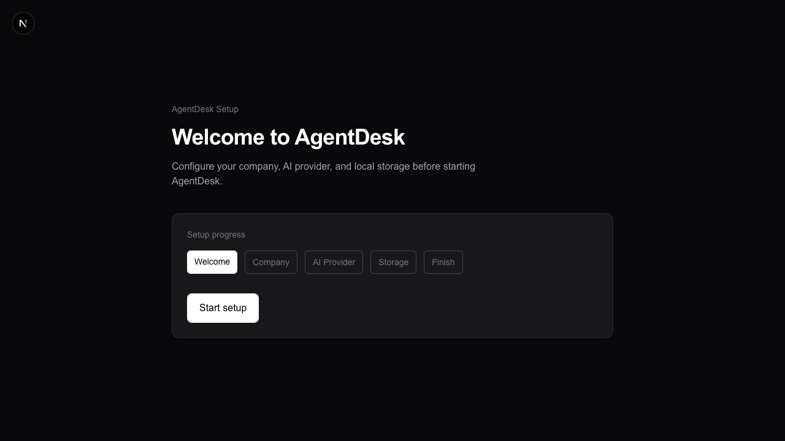
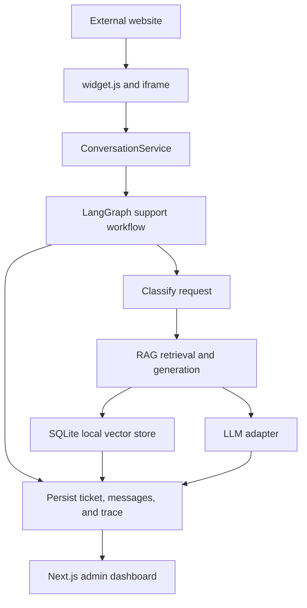
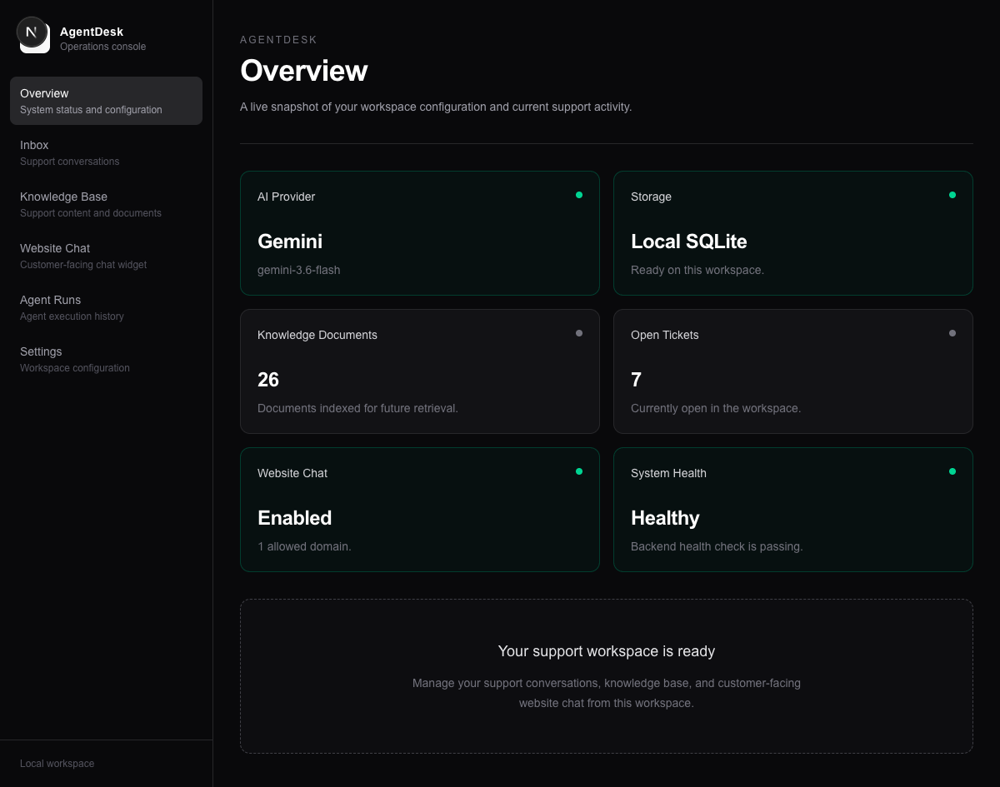

# AgentDesk

AgentDesk is a local-first customer support workspace for grounded AI
assistance. It combines a setup wizard, admin dashboard, knowledge base,
persistent tickets, an embeddable website widget, and inspectable agent traces.



## Architecture



The backend uses FastAPI, SQLAlchemy, Alembic, and SQLite. The frontend uses
Next.js. Local embeddings, provider adapters, LangGraph workflow execution,
and dashboard persistence are kept behind their respective application
services.

## Quick start

Requirements: Python 3.11+, Node.js/npm, and network access for the selected AI
provider and the first local embedding-model download.

```bash
python3 -m venv .venv
source .venv/bin/activate
python -m pip install -r backend/requirements.txt

cd frontend
npm install
cd ..
python run.py
```

The launcher applies database migrations, starts FastAPI on
`http://127.0.0.1:8000`, starts Next.js on `http://127.0.0.1:3000`, and opens
the application. Complete the first-run flow in this order:

1. Welcome
2. Company
3. AI Provider
4. Storage
5. Finish

Provider keys are encrypted by the backend and are never returned by the API or
exposed to the website widget.

## Dashboard



The dashboard pages provide the following functionality:

| Page | Features |
| --- | --- |
| **Overview** | Live workspace summary: AI provider and model, local storage health, indexed document count, open tickets, widget status, and backend health. |
| **Inbox** | Browse and filter support tickets, view customer and AgentDesk messages, change ticket status, and open the related agent trace. |
| **Knowledge Base** | Upload PDF, DOCX, TXT, and Markdown files; monitor processing status; view document details; re-index or delete documents; and open the RAG test console. |
| **Test Knowledge** | Ask a question against indexed documents, review the grounded answer, citations, retrieved chunks, latency, and insufficient-evidence result. |
| **Website Chat** | Configure the widget display name, welcome message, launcher position, enabled state, and exact allowed website origins. The page also shows the installation snippet. |
| **Agent Runs** | Inspect execution history, node order, classification, retrieval, generation, guard results, provider/model details, latency, and safe failure metadata. |
| **Settings** | Update company details and AI provider settings, select a supported model, test a provider connection, and review local SQLite storage status. |

## Knowledge base and RAG

The sample AcmeFlow knowledge base is in `samples/demo-company/`. It contains
25 support documents across PDF, DOCX, TXT, and Markdown formats. Load it with:

```bash
python scripts/load_demo_knowledge.py
```

Documents are parsed, deterministically chunked, embedded, and indexed. The
default `all-MiniLM-L6-v2` local embedding service works independently of
Gemini, OpenRouter, and their API keys. LLM providers are used only for
classification and answer generation.

RAG answers cite retrieved source documents when evidence is sufficient. When
the knowledge base cannot support an answer, AgentDesk returns an explicit
insufficient-evidence response. Account-specific questions are routed to a
safe human-review path without inventing customer data or status.

## Website widget

After configuring an allowed origin in **Website Chat**, add the script to the
external site:

```html
<script
  src="http://127.0.0.1:8000/widget.js"
  data-project="local-default"
></script>
```

The loader creates a server-issued anonymous session and mounts the chat UI in
an isolated iframe and Shadow DOM. Host-page CSS cannot style the internal chat
controls. Widget messages, AI replies, tickets, and agent runs are persisted.

The local demo site is in `demo-widget-site/`:

```bash
cd demo-widget-site
python -m http.server 3002
```

Configure `http://localhost:3002` as an allowed origin before opening it.

## Security

Runtime data is stored under `backend/data/` by default. It contains the local
database, encrypted-secret key, source documents, vectors, tickets, messages,
and traces, and is ignored by Git. Do not commit `.env` files or provider keys.
Widget access is restricted to exact configured HTTP(S) origins, and retrieved
document text is treated as untrusted content.

## Verification

```bash
cd backend
python -m pytest
alembic check

cd ../frontend
npm run lint
npx tsc --noEmit
npm run build -- --webpack

cd ..
git diff --check
```

## Project structure

```text
backend/              FastAPI services, models, migrations, and tests
frontend/             Next.js dashboard, setup wizard, and widget iframe
demo-widget-site/     External widget demo and CSS-isolation fixture
samples/demo-company/ Sample AcmeFlow knowledge corpus
samples/test-fixtures Test documents for ingestion and security scenarios
scripts/              Local sample-data helpers
docs/                 Acceptance record and supporting assets
run.py                Local development launcher
```

V1 intentionally does not include business-system write actions, real account
or payment integrations, enterprise authentication/RBAC, OCR, or cloud
deployment automation.
